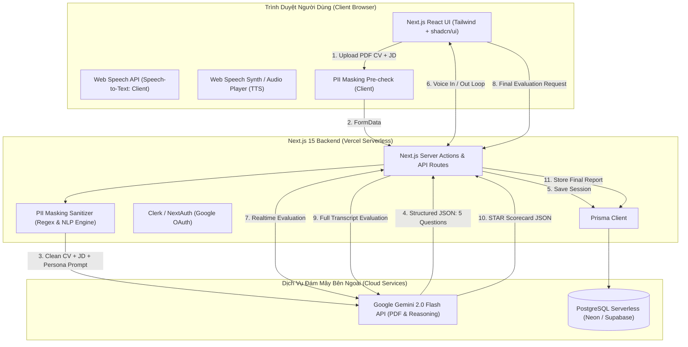
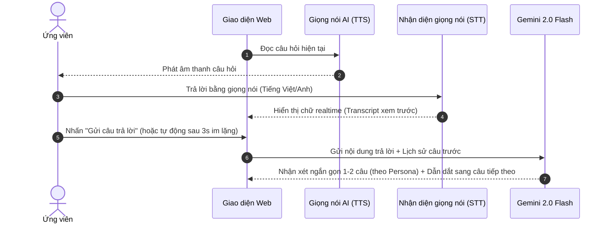

# SYSTEM ARCHITECTURE & TECHNICAL DESIGN: AI-INTERVIEW

Tài liệu thiết kế kiến trúc kỹ thuật toàn diện cho nền tảng **AI-Interview**, phục vụ phát triển sản phẩm và bảo vệ đồ án / dự án khởi nghiệp.

---

## 1. Sơ Đồ Kiến Trúc Tổng Thể (System Architecture)



---

## 2. Luồng Xử Lý Dữ Liệu (End-to-End Data Flow)

### Bước 1: Setup & Anonymization (Khởi tạo & Khử định danh PII)
1. Ứng viên tải lên file `CV.pdf` và dán nội dung văn bản `Job Description (JD)`.
2. Chọn **Ngôn ngữ** (`vi` hoặc `en`) và **Persona** (`friendly_hr`, `challenging_manager`, `tech_lead`).
3. Module **PII Masking** chạy quét nội dung:
   - Số điện thoại VN (`09x`, `08x`, `+84...`) $\rightarrow$ Thay bằng `[REDACTED_PHONE]`.
   - Email cá nhân $\rightarrow$ Thay bằng `[REDACTED_EMAIL]`.
   - Địa chỉ nhà, link mạng xã hội cá nhân $\rightarrow$ Thay bằng `[REDACTED_ADDRESS]`.
4. File PDF đã làm sạch được chuyển thành dạng Base64/Buffer và gửi kèm prompt so khớp tới Gemini 2.0 Flash.

---

### Bước 2: AI Dynamic Cross-Matching (So khớp thông minh & Sinh câu hỏi)
Gemini 2.0 Flash nhận đồng thời:
- **CV Buffer (PDF):** Trích xuất học vấn, kinh nghiệm, dự án, kỹ năng.
- **JD Text:** Trích xuất yêu cầu công việc, kỹ năng bắt buộc, trách nhiệm.
- **Persona Prompt:** Định hình phong cách người phỏng vấn.

Gemini thực hiện:
- Phát hiện **2-3 điểm mạnh** nổi bật của ứng viên khớp với JD.
- Phát hiện **1-2 "lỗ hổng"** kinh nghiệm hoặc điểm mơ hồ trong CV so với JD.
- Sinh bộ **5 câu hỏi chuẩn hóa**:
  - *Câu 1 (Warm-up):* Giới thiệu bản thân & động lực ứng tuyển.
  - *Câu 2 & 3 (STAR Behavioral):* Tình huống xử lý xung đột, áp lực hoặc làm việc nhóm.
  - *Câu 4 (Role-specific / Problem Solving):* Đào sâu vào dự án tiêu biểu trong CV hoặc kỹ năng cốt lõi của JD.
  - *Câu 5 (Situational / Culture Fit):* Tình huống thực tế khi đối mặt khó khăn tại doanh nghiệp.

---

### Bước 3: Phòng Phỏng Vấn Giọng Nói (Interactive Turn-based Voice)


---

### Bước 4: Chấm Điểm & Báo Cáo Chuyên Sâu (STAR Evaluation Engine)
Sau khi kết thúc 5 câu hỏi, toàn bộ Transcript được gửi sang Gemini để tổng hợp thành Báo cáo:
- **Khung STAR (Thang điểm 10/10 mỗi tiêu chí):**
  - **Situation:** Có mô tả bối cảnh cụ thể, rõ ràng không?
  - **Task:** Có chỉ rõ trách nhiệm và mục tiêu cần đạt được không?
  - **Action:** Có nêu bật hành động của CHÍNH BẢN THÂN (thay vì nói chung chung "chúng em/team em") không?
  - **Result:** Có đưa ra kết quả định lượng (số liệu, % tăng trưởng, bài học) không?
- **Điểm tổng quan:** Quy đổi sang thang 100 điểm.
- **Điểm mạnh & Điểm cần cải thiện:** Gợi ý cách sửa câu từ chi tiết cho từng câu trả lời.
- **Câu trả lời mẫu điểm 10 (Gold Standard Answer):** AI soạn sẵn câu trả lời lý tưởng dựa trên chính kinh nghiệm thực tế của ứng viên trong CV.

---

## 3. Thiết Kế Cơ Sở Dữ Liệu (Database Schema - Prisma)

```prisma
datasource db {
  provider = "postgresql"
  url      = env("DATABASE_URL")
}

generator client {
  provider = "prisma-client-js"
}

enum InterviewStatus {
  SETUP
  IN_PROGRESS
  COMPLETED
  ABANDONED
}

enum PersonaType {
  FRIENDLY_HR
  CHALLENGING_MANAGER
  TECH_LEAD
}

enum LanguageCode {
  VI
  EN
}

enum MessageRole {
  INTERVIEWER
  CANDIDATE
}

model User {
  id             String             @id @default(cuid())
  email          String             @unique
  name           String?
  avatarUrl      String?
  sessions       InterviewSession[]
  createdAt      DateTime           @default(now())
  updatedAt      DateTime           @updatedAt
}

model InterviewSession {
  id             String             @id @default(cuid())
  userId         String
  user           User               @relation(fields: [userId], references: [id], onDelete: Cascade)
  
  jobTitle       String
  jobDescription String             @db.Text
  language       LanguageCode       @default(VI)
  persona        PersonaType        @default(FRIENDLY_HR)
  status         InterviewStatus    @default(SETUP)
  
  // Dữ liệu phân tích khởi tạo
  extractedSkills Json?
  identifiedGaps  Json?
  
  messages       Message[]
  feedbackReport FeedbackReport?
  
  createdAt      DateTime           @default(now())
  updatedAt      DateTime           @updatedAt
}

model Message {
  id             String             @id @default(cuid())
  sessionId      String
  session        InterviewSession   @relation(fields: [sessionId], references: [id], onDelete: Cascade)
  
  role           MessageRole
  content        String             @db.Text
  orderIndex     Int
  durationSec    Int?
  
  createdAt      DateTime           @default(now())
}

model FeedbackReport {
  id                 String           @id @default(cuid())
  sessionId          String           @unique
  session            InterviewSession @relation(fields: [sessionId], references: [id], onDelete: Cascade)
  
  overallScore       Int              // 1 - 100
  situationScore     Int              // 1 - 10
  taskScore          Int              // 1 - 10
  actionScore        Int              // 1 - 10
  resultScore        Int              // 1 - 10
  
  strengths          Json             // Mảng các điểm mạnh
  weaknesses         Json             // Mảng các điểm cần cải thiện
  questionFeedbacks  Json             // Đánh giá chi tiết & gợi ý sửa từng câu
  sampleBetterAnswer Json             // Câu trả lời mẫu điểm 10
  
  createdAt          DateTime         @default(now())
}
```

---

## 4. Định Dạng Dữ Liệu Trao Đổi Với Gemini (JSON Contracts)

### Contract 1: Đầu ra của bước Sinh câu hỏi (Question Generation Output)
```json
{
  "summary": {
    "extractedSkills": ["React", "TypeScript", "Tailwind CSS"],
    "identifiedGaps": ["Chưa có kinh nghiệm thực tế về tối ưu hiệu năng SSR", "Dự án cá nhân còn nhỏ"]
  },
  "questions": [
    {
      "order": 1,
      "category": "WARM_UP",
      "questionVi": "Chào bạn, hãy giới thiệu ngắn gọn về bản thân và lý do bạn muốn ứng tuyển vào vị trí này?",
      "questionEn": "Hello, please introduce yourself briefly and tell us why you are interested in this position?",
      "targetGoal": "Đánh giá khả năng tóm tắt bản thân và độ nhiệt huyết"
    },
    {
      "order": 2,
      "category": "BEHAVIORAL_STAR",
      "questionVi": "Hãy kể về một lần bạn gặp bất đồng ý kiến với thành viên trong nhóm và cách bạn giải quyết nó?",
      "questionEn": "Tell me about a time you had a disagreement with a team member and how you resolved it?",
      "targetGoal": "Đánh giá kỹ năng giao tiếp và xử lý xung đột (STAR)"
    }
  ]
}
```

---

## 5. Chiến Lược Chi Phí (Unit Economics & Startup Viability)

- **Gemini 2.0 Flash:**
  - Input: ~2,500 tokens (PDF CV + JD + Prompts) $\approx$ 0.00025 USD
  - 5 lượt hỏi đáp: ~1,500 tokens $\approx$ 0.00015 USD
  - Tổng kết báo cáo STAR: ~2,000 tokens $\approx$ 0.00040 USD
  - **Tổng chi phí token AI / buổi:** ~0.0008 USD $\approx$ **20 - 50 VNĐ**
- **Hosting & Database (Free Tier):**
  - Vercel: Miễn phí
  - Neon / Supabase: Miễn phí đến hàng chục nghìn lượt truy cập
  - Web Speech API: Chạy trên máy người dùng, chi phí 0đ
- **Kết luận:** Mô hình này hoàn toàn khả thi để cung cấp gói **Miễn phí 3 buổi thử nghiệm** cho sinh viên, sau đó mở bán gói **Freemium 29.000đ - 49.000đ/tháng** với biên lợi nhuận ròng trên 90%.
